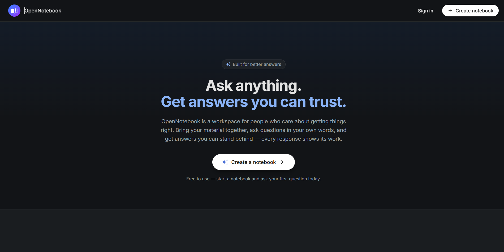
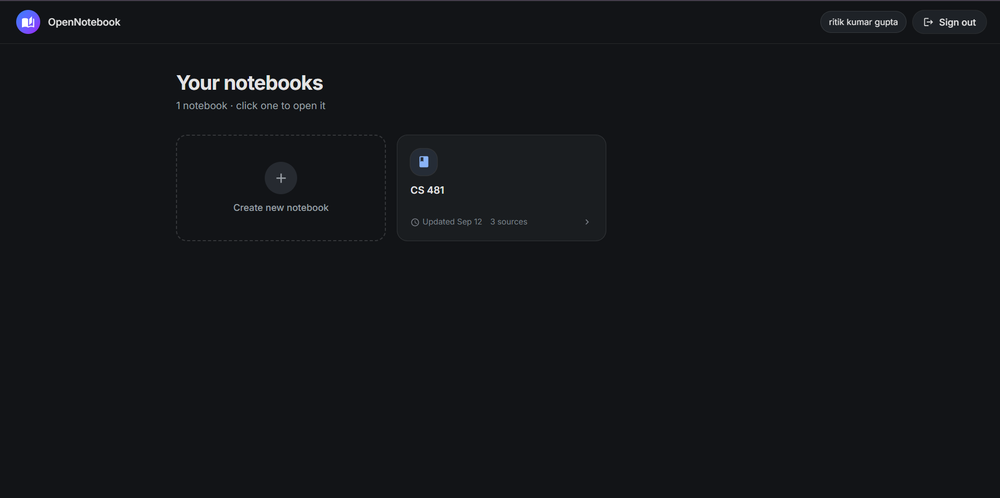
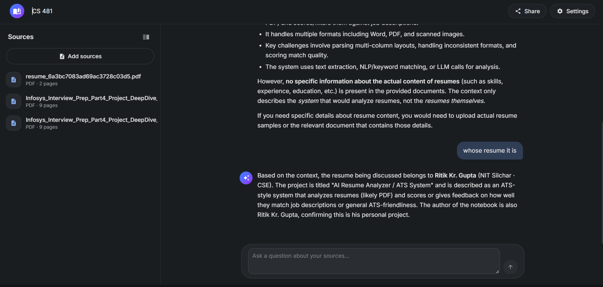

# 📚 RAG Notebook

### AI-Powered Document Question Answering Platform

RAG Notebook is a full-stack AI application that allows users to upload PDF documents, organize them into notebooks, and ask natural-language questions about their uploaded content.

The application uses **Retrieval-Augmented Generation (RAG)** to retrieve relevant information from uploaded documents and provide context-aware answers using an LLM.

The project is built with a **React frontend** and **FastAPI backend**, with MongoDB for application data, Qdrant for vector search, OpenRouter for AI models, Amazon S3 for PDF storage, and Amazon SQS for asynchronous processing.

---

## 🚧 Project Status

> **Currently running locally — not publicly deployed yet.**

The project is developed as a complete frontend + backend application and requires the configured external services and environment variables to run locally.

---

# ✨ Features

- 🔐 User registration and login
- 🔑 JWT-based authentication
- 🔒 Password hashing with Argon2
- 📚 Notebook creation and management
- ✏️ Notebook renaming
- 🗑️ Notebook and source deletion
- 📄 PDF document upload
- 📦 Multiple document management
- ☁️ Amazon S3 document storage
- ⚙️ Asynchronous document processing
- 📨 Amazon SQS message queue
- 📖 PDF text extraction using PyMuPDF
- ✂️ Recursive text chunking
- 🧠 Document embeddings
- 🔎 Semantic vector search
- 🗃️ Qdrant vector database
- 🤖 LLM-powered question answering
- 🧩 Retrieval-Augmented Generation (RAG)
- 💬 Context-aware conversations
- 📝 Conversation history
- 📊 Document processing status
- ⚡ Background worker architecture
- 📈 Upload progress tracking
- 🛡️ User-specific resource access
- 🎨 Responsive modern UI
- ✨ Framer Motion animations
- 📝 Markdown-rendered AI responses
- 🔔 Toast notifications
- ⚡ Optimistic chat interactions

---

# 📸 Project Screenshots

The application is currently running locally and has not been publicly deployed yet.

## 🏠 Home Page



---

## 📚 Notebook Workspace



---

## 💬 AI Question Answering



---

# 🧠 What is RAG?

**Retrieval-Augmented Generation (RAG)** combines information retrieval with Large Language Models.

Instead of directly asking an LLM to answer a question using only its pretrained knowledge, the application first searches the user's uploaded documents for relevant information.

The retrieved document chunks are then provided to the LLM as context before generating the final answer.

### RAG Pipeline

```text
                User Question
                      │
                      ▼
             Generate Embedding
                      │
                      ▼
              Qdrant Vector Search
                      │
                      ▼
            Relevant Document Chunks
                      │
                      ▼
             Context + User Query
                      │
                      ▼
                OpenRouter LLM
                      │
                      ▼
              Grounded AI Answer
````

---

# 🏗️ System Architecture

```text
                         ┌───────────────────────┐
                         │       React 19        │
                         │       Frontend        │
                         └───────────┬───────────┘
                                     │
                                     │ REST API
                                     ▼
                         ┌───────────────────────┐
                         │        FastAPI        │
                         │        Backend        │
                         └───────────┬───────────┘
                                     │
              ┌──────────────────────┼──────────────────────┐
              │                      │                      │
              ▼                      ▼                      ▼
       ┌─────────────┐        ┌─────────────┐        ┌─────────────┐
       │   MongoDB   │        │  Amazon S3  │        │  Amazon SQS │
       │ Application │        │ PDF Storage │        │ Message     │
       │    Data     │        │             │        │ Queue       │
       └─────────────┘        └──────┬──────┘        └──────┬──────┘
                                     │                      │
                                     │                      ▼
                                     │              ┌──────────────┐
                                     │              │   Worker     │
                                     │              └──────┬───────┘
                                     │                     │
                                     │                     ▼
                                     │              ┌──────────────┐
                                     │              │    PyMuPDF   │
                                     │              │ PDF Extraction│
                                     │              └──────┬───────┘
                                     │                     │
                                     │                     ▼
                                     │              ┌──────────────┐
                                     │              │  LangChain   │
                                     │              │ Text Splitter│
                                     │              └──────┬───────┘
                                     │                     │
                                     │                     ▼
                                     │              ┌──────────────┐
                                     │              │  Embeddings  │
                                     │              │  OpenRouter  │
                                     │              └──────┬───────┘
                                     │                     │
                                     │                     ▼
                                     │              ┌──────────────┐
                                     │              │    Qdrant    │
                                     │              │ Vector Search│
                                     │              └──────┬───────┘
                                     │                     │
                                     │                     ▼
                                     │              ┌──────────────┐
                                     │              │  OpenRouter  │
                                     │              │     LLM      │
                                     │              └──────────────┘
```

---

# 🔄 Application Workflow

## 1. Authentication

Users can create an account and log in through the React frontend.

```text
Signup
  │
  ▼
FastAPI
  │
  ▼
Password Hashing
  │
  ▼
MongoDB
  │
  ▼
User Created
```

During login:

```text
Email + Password
       │
       ▼
MongoDB User Lookup
       │
       ▼
Password Verification
       │
       ▼
JWT Generation
       │
       ▼
Authenticated Frontend
```

Protected API requests use:

```http
Authorization: Bearer <token>
```

---

# 📄 2. PDF Upload

When a user uploads a PDF:

```text
React Frontend
      │
      ▼
FastAPI
      │
      ▼
PDF Validation
      │
      ▼
Amazon S3
      │
      ▼
Source Metadata → MongoDB
      │
      ▼
SQS Message
      │
      ▼
Background Worker
```

The API does not perform the complete document-processing pipeline synchronously.

The processing task is placed into **Amazon SQS**, allowing the background worker to process the document asynchronously.

---

# 📖 3. Document Processing

The worker processes the uploaded PDF through the following pipeline:

```text
Amazon SQS
     │
     ▼
Background Worker
     │
     ▼
Download PDF from S3
     │
     ▼
PyMuPDF
     │
     ▼
Extract PDF Text
     │
     ▼
Recursive Character Text Splitter
     │
     ▼
Text Chunks
     │
     ▼
Generate Embeddings
     │
     ▼
Qdrant
```

### Chunking

The application uses a recursive text-splitting strategy to divide extracted PDF content into smaller chunks before generating embeddings.

The configured chunking parameters are:

```text
Chunk Size   → 2500 characters
Chunk Overlap → 300 characters
```

---

# 🧠 4. Embedding Pipeline

Each document chunk is transformed into a vector representation.

```text
Document Chunk
      │
      ▼
OpenRouter Embedding API
      │
      ▼
Embedding Vector
      │
      ▼
Qdrant
```

The embedding model is configured through environment variables.

Qdrant is used to store the generated vectors along with document metadata.

---

# 🔎 5. Semantic Search

When a user asks a question:

```text
User Question
      │
      ▼
Generate Query Embedding
      │
      ▼
Qdrant Similarity Search
      │
      ▼
Notebook-Level Filtering
      │
      ▼
Relevant Document Chunks
```

The search is scoped to the selected notebook so that retrieved information comes from the relevant uploaded sources.

The application retrieves the most relevant document chunks and provides them as context to the LLM.

---

# 🤖 6. AI Question Answering

The complete question-answering workflow is:

```text
User Question
      │
      ▼
React Frontend
      │
      ▼
FastAPI
      │
      ▼
Save User Message
      │
      ▼
MongoDB
      │
      ▼
Amazon SQS
      │
      ▼
Background Worker
      │
      ▼
Question Embedding
      │
      ▼
Qdrant Semantic Search
      │
      ▼
Relevant Document Context
      │
      ▼
Conversation Context
      │
      ▼
Prompt Construction
      │
      ▼
OpenRouter LLM
      │
      ▼
Generated Answer
      │
      ▼
MongoDB
      │
      ▼
Frontend
      │
      ▼
AI Response
```

---

# 🎯 Grounded Responses

The RAG pipeline is designed to make responses dependent on the retrieved document context.

The AI assistant is instructed to:

* Use the retrieved document context
* Avoid unsupported claims
* Avoid guessing when information is unavailable
* Inform the user when relevant information cannot be found
* Return responses in Markdown
* Respond in the same language as the user's question

This helps keep answers grounded in the user's uploaded documents.

---

# 💬 Conversation Management

Conversation messages are stored in MongoDB.

Messages contain information such as:

```text
Message ID
Notebook ID
Role
Content
Status
Model
Timestamp
```

Previous conversation context can be incorporated into the prompt when generating subsequent answers.

---

# ⚡ Asynchronous Processing

Amazon SQS is used to separate long-running AI and document-processing tasks from the API request lifecycle.

The application uses events such as:

```text
source.processing
chat.ask
```

### Document processing

```text
PDF Upload
    ↓
S3
    ↓
SQS
    ↓
Worker
    ↓
PDF Extraction
    ↓
Chunking
    ↓
Embeddings
    ↓
Qdrant
```

### Chat processing

```text
User Question
    ↓
SQS
    ↓
Worker
    ↓
Query Embedding
    ↓
Qdrant Search
    ↓
Context Retrieval
    ↓
LLM
    ↓
MongoDB
    ↓
Frontend
```

---

# 🗃️ Database Architecture

## MongoDB

MongoDB is used as the primary application database.

The backend uses **Motor** for asynchronous MongoDB operations.

### Main data models

```text
users
notebooks
sources
messages
```

### Users

Stores user information and authentication-related data.

### Notebooks

Stores:

* Notebook ID
* Owner ID
* Notebook title
* Timestamps

### Sources

Stores:

* Source ID
* Notebook ID
* Owner ID
* Filename
* File type
* File size
* S3 key
* Processing status
* Page count
* Chunk count
* Error information
* Timestamps

### Messages

Stores:

* Message ID
* Notebook ID
* Role
* Content
* Status
* Model
* Timestamp

---

# 🧮 Qdrant Vector Database

Qdrant stores embeddings generated from document chunks.

Each vector is associated with metadata such as:

```text
notebook_id
source_id
page
chunk_index
filename
text
```

This metadata allows the application to:

* Filter results by notebook
* Identify the source document
* Identify the page
* Retrieve the original text chunk
* Delete vectors belonging to a source

---

# ☁️ Amazon S3

Amazon S3 is used for storing uploaded PDF files.

The backend organizes files using notebook and source identifiers.

```text
notebooks/
    {notebook_id}/
        sources/
            {source_id}/
                original.pdf
```

S3 operations include:

* Upload PDF
* Download PDF for processing
* Delete PDF

---

# 📨 Amazon SQS

Amazon SQS provides asynchronous task processing.

The worker:

1. Polls the queue
2. Receives a message
3. Identifies the event type
4. Executes the corresponding processing logic
5. Acknowledges successfully processed messages
6. Allows failed messages to retry

---

# 🔐 Authentication & Security

The backend uses JWT-based authentication.

### Authentication Stack

```text
JWT
PyJWT
pwdlib
Argon2
FastAPI Middleware
Environment Variables
```

Passwords are hashed before being stored.

The application also performs ownership checks to ensure that authenticated users can access only their own notebooks and sources.

---

# 🌐 REST API

The backend exposes versioned REST APIs under:

```text
/api/v1
```

### Authentication

```http
POST /api/v1/auth/signup
POST /api/v1/auth/login
```

### Notebooks

```http
GET    /api/v1/notebooks
POST   /api/v1/notebooks
GET    /api/v1/notebooks/{notebook_id}
PATCH  /api/v1/notebooks/{notebook_id}
DELETE /api/v1/notebooks/{notebook_id}
```

### Sources

```http
POST   /api/v1/sources
GET    /api/v1/sources
DELETE /api/v1/sources/{source_id}
```

### Chat

```http
POST /api/v1/ask
GET  /api/v1/ask
```

### Health Check

```http
GET /
```

---

# 🎨 Frontend Architecture

The frontend is built using:

* React 19
* JavaScript / JSX
* Vite
* Tailwind CSS
* React Router
* Axios
* React Context API
* Framer Motion
* Radix UI
* React Markdown
* Sonner
* React Icons
* date-fns

---

# 🧩 Frontend Structure

```text
frontend/
│
├── public/
│
├── src/
│   │
│   ├── components/
│   │   ├── home/
│   │   ├── notebook/
│   │   ├── shared/
│   │   └── ui/
│   │
│   ├── configs/
│   │   └── axios.js
│   │
│   ├── context/
│   │   ├── AuthContext.jsx
│   │   └── WorkspaceContext.jsx
│   │
│   ├── pages/
│   │   ├── HomePage.jsx
│   │   ├── LoginPage.jsx
│   │   ├── SignupPage.jsx
│   │   ├── DashboardPage.jsx
│   │   └── NotebookPage.jsx
│   │
│   ├── utils/
│   │   ├── cn.js
│   │   └── notebooks.js
│   │
│   ├── App.jsx
│   ├── main.jsx
│   └── index.css
│
├── package.json
└── vite.config.js
```

---

# 🧠 Frontend State Management

The frontend uses **React Context API** for application state management.

## AuthContext

Handles authentication-related state such as:

```text
Login
Signup
Current User
Authentication State
Token
Logout
```

## WorkspaceContext

Handles notebook workspace state such as:

```text
Notebook
Sources
Uploads
Messages
Chat
Source Processing
Notebook Management
```

---

# 📤 File Upload Experience

The frontend provides a complete PDF upload workflow including:

* PDF validation
* Upload progress
* Multiple source handling
* Processing status
* Error handling
* Source deletion
* Source refresh

Axios upload progress events are used to display upload progress in the interface.

---

# 💬 Chat Experience

The frontend provides an interactive AI chat interface.

```text
User enters question
        ↓
Optimistic user message
        ↓
Assistant loading state
        ↓
API request
        ↓
Backend queues task
        ↓
Background processing
        ↓
Frontend retrieves updated message state
        ↓
Assistant response
```

AI responses are rendered using Markdown.

---

# ✨ UI / UX

The interface uses:

* Tailwind CSS
* Radix UI
* Framer Motion
* React Icons
* Sonner
* Responsive layouts
* Loading skeletons
* Progress indicators
* Toast notifications
* Animated transitions
* Markdown rendering

---

# 🛠️ Technology Stack

## Frontend

| Technology       | Purpose                 |
| ---------------- | ----------------------- |
| React 19         | UI framework            |
| JavaScript / JSX | Application development |
| Vite             | Frontend build tooling  |
| Tailwind CSS     | Styling                 |
| React Router     | Client-side routing     |
| Axios            | API communication       |
| Context API      | State management        |
| Framer Motion    | Animations              |
| Radix UI         | UI primitives           |
| React Markdown   | AI response rendering   |
| Sonner           | Notifications           |
| React Icons      | Icons                   |
| date-fns         | Date utilities          |

## Backend

| Technology       | Purpose                     |
| ---------------- | --------------------------- |
| Python           | Backend development         |
| FastAPI          | REST API framework          |
| Uvicorn          | ASGI server                 |
| Pydantic         | Data validation             |
| Motor            | Asynchronous MongoDB access |
| PyMongo          | MongoDB utilities           |
| HTTPX            | HTTP client                 |
| python-dotenv    | Environment configuration   |
| python-multipart | File upload handling        |

## AI / RAG

| Technology               | Purpose                              |
| ------------------------ | ------------------------------------ |
| OpenRouter               | LLM and embedding API access         |
| OpenAI SDK               | OpenAI-compatible API client         |
| LangChain Text Splitters | Document chunking                    |
| Qdrant                   | Vector database                      |
| Embeddings               | Semantic representation              |
| RAG                      | Document-grounded question answering |

## Document Processing

| Technology                     | Purpose             |
| ------------------------------ | ------------------- |
| PyMuPDF                        | PDF text extraction |
| RecursiveCharacterTextSplitter | Text chunking       |

## Cloud Infrastructure

| Technology | Purpose                      |
| ---------- | ---------------------------- |
| Amazon S3  | PDF object storage           |
| Amazon SQS | Asynchronous task processing |
| Boto3      | AWS SDK for Python           |

## Authentication

| Technology | Purpose                    |
| ---------- | -------------------------- |
| JWT        | Authentication tokens      |
| PyJWT      | JWT implementation         |
| pwdlib     | Password hashing           |
| Argon2     | Password hashing algorithm |

---

# 📁 Project Structure

```text
RAG Notebook/
│
├── backend/
│   │
│   ├── src/
│   │   ├── api/
│   │   │   └── v1/
│   │   │       ├── auth.py
│   │   │       ├── chat.py
│   │   │       ├── notebooks.py
│   │   │       ├── sources.py
│   │   │       └── router.py
│   │   │
│   │   ├── configs/
│   │   │   ├── db.py
│   │   │   ├── llm.py
│   │   │   ├── qdrant.py
│   │   │   ├── s3.py
│   │   │   └── sqs.py
│   │   │
│   │   ├── middlewares/
│   │   │   └── auth_middleware.py
│   │   │
│   │   ├── models/
│   │   │   ├── common.py
│   │   │   ├── message.py
│   │   │   ├── notebook.py
│   │   │   ├── source.py
│   │   │   └── user.py
│   │   │
│   │   ├── schemas/
│   │   │   ├── auth.py
│   │   │   ├── chat.py
│   │   │   ├── notebook.py
│   │   │   └── source.py
│   │   │
│   │   ├── services/
│   │   │   ├── auth.py
│   │   │   ├── chat.py
│   │   │   ├── chunking.py
│   │   │   ├── embeddings.py
│   │   │   ├── notebook.py
│   │   │   ├── qdrant.py
│   │   │   └── s3.py
│   │   │
│   │   ├── sqs/
│   │   │   ├── consumers/
│   │   │   │   ├── chat.py
│   │   │   │   └── source.py
│   │   │   ├── core.py
│   │   │   ├── producer.py
│   │   │   └── worker.py
│   │   │
│   │   ├── utils/
│   │   │   ├── chat.py
│   │   │   ├── deps.py
│   │   │   └── security.py
│   │   │
│   │   └── main.py
│   │
│   ├── .env.example
│   ├── pyproject.toml
│   ├── requirements.txt
│   └── README.md
│
├── frontend/
│   │
│   ├── public/
│   │
│   ├── src/
│   │   ├── components/
│   │   │   ├── home/
│   │   │   ├── notebook/
│   │   │   ├── shared/
│   │   │   └── ui/
│   │   │
│   │   ├── configs/
│   │   │   └── axios.js
│   │   │
│   │   ├── context/
│   │   │   ├── AuthContext.jsx
│   │   │   └── WorkspaceContext.jsx
│   │   │
│   │   ├── pages/
│   │   │   ├── HomePage.jsx
│   │   │   ├── LoginPage.jsx
│   │   │   ├── SignupPage.jsx
│   │   │   ├── DashboardPage.jsx
│   │   │   └── NotebookPage.jsx
│   │   │
│   │   ├── utils/
│   │   │   ├── cn.js
│   │   │   └── notebooks.js
│   │   │
│   │   ├── App.jsx
│   │   ├── main.jsx
│   │   └── index.css
│   │
│   ├── package.json
│   └── vite.config.js
│
├── .gitignore
└── README.md
```

---

# ⚙️ Environment Variables

Create a `.env` file inside the `backend` directory.

```env
APP_NAME=OpenNotebook
DEBUG=true

SECRET_KEY=your-secret-key
ACCESS_TOKEN_EXPIRE_MINUTES=10080

MONGODB_URI=your-mongodb-uri
DB_NAME=opennotebook

CORS_ORIGINS=http://localhost:5173,http://127.0.0.1:5173

AWS_S3_BUCKET=your-bucket
AWS_ACCESS_KEY_ID=your-access-key
AWS_SECRET_ACCESS_KEY=your-secret-key
AWS_SQS_QUEUE_URL=your-queue-url

QDRANT_API_KEY=your-qdrant-api-key
QDRANT_ENDPOINT=your-qdrant-endpoint

OPENROUTER_EMBEDDING_MODEL=your-embedding-model
OPENROUTER_CHAT_MODEL=your-chat-model
OPENROUTER_API_KEY=your-openrouter-api-key
```

> **Never commit the real `.env` file or API keys to GitHub.**

---

# 🚀 Running Locally

## Prerequisites

Make sure the following are installed or configured:

* Python 3.12+
* Node.js
* npm
* MongoDB
* Qdrant
* OpenRouter API access
* AWS account
* Amazon S3 bucket
* Amazon SQS queue

---

# 🔧 Backend Setup

```bash
cd backend
```

Create a virtual environment:

```bash
python -m venv .venv
```

Activate it on Windows:

```powershell
.venv\Scripts\activate
```

Install dependencies:

```bash
pip install -r requirements.txt
```

Create the environment file:

```powershell
copy .env.example .env
```

Configure the required credentials inside `.env`.

Start the FastAPI server:

```bash
uvicorn src.main:app --reload
```

Backend:

```text
http://localhost:8000
```

FastAPI documentation:

```text
http://localhost:8000/docs
```

---

# 💻 Frontend Setup

Open another terminal:

```bash
cd frontend
```

Install dependencies:

```bash
npm install
```

Start the development server:

```bash
npm run dev
```

Frontend:

```text
http://localhost:5173
```

---

# 🧪 Development Commands

### Frontend

Start development server:

```bash
npm run dev
```

Build:

```bash
npm run build
```

Lint:

```bash
npm run lint
```

Preview production build:

```bash
npm run preview
```

### Backend

Start development server:

```bash
uvicorn src.main:app --reload
```

Run tests:

```bash
pytest
```

---

# 🔄 Source Lifecycle

A document source follows a processing lifecycle:

```text
Uploading
    │
    ▼
Processing
    │
    ├──────────────► Failed
    │
    ▼
Ready
```

The frontend displays the current processing state of uploaded sources.

---

# 🧹 Source Deletion

When a source is deleted, the application removes its associated resources.

```text
Delete Request
      │
      ▼
Verify Ownership
      │
      ├───────────────┐
      ▼               ▼
Delete S3 File   Delete Qdrant Vectors
      │               │
      └───────┬───────┘
              ▼
       Delete MongoDB
       Source Metadata
```

This keeps object storage, vector storage, and application metadata synchronized.

---

# 🛡️ Data Isolation

Application resources are associated with authenticated users.

Notebook and source operations use ownership checks to prevent unauthorized access.

Vector retrieval is also scoped to the selected notebook.

```text
Authenticated User
        │
        ▼
     Notebook
        │
        ├── Sources
        │
        ├── Messages
        │
        └── Vector Search
```

---

# 📐 Design Decisions

## Why MongoDB?

MongoDB is used for application-level data such as users, notebooks, sources, and messages.

Its document-oriented structure fits the application's flexible data models and works with asynchronous database access through Motor.

## Why Qdrant?

Qdrant is used for semantic vector search.

It provides:

* Vector storage
* Similarity search
* Metadata filtering
* Notebook/source-based retrieval

## Why Amazon S3?

PDF documents are binary objects and are stored separately from the application database using Amazon S3.

## Why Amazon SQS?

Document processing and AI generation can involve operations that should not block the main API request.

Amazon SQS allows these tasks to be processed asynchronously by background workers.

## Why LangChain Text Splitter?

Large documents need to be divided into smaller chunks before generating embeddings.

`RecursiveCharacterTextSplitter` provides a structured approach to creating these chunks while maintaining useful text boundaries.

## Why OpenRouter?

OpenRouter provides access to the configured LLM and embedding models through an OpenAI-compatible API interface.

---

# 📊 RAG Configuration

The current RAG pipeline uses:

```text
Chunk Size        → 2500 characters
Chunk Overlap     → 300 characters
Vector Database   → Qdrant
Distance Metric   → Cosine Similarity
```

The retrieval configuration can be adjusted as the application evolves.

---

# 🧪 Testing

The backend includes testing dependencies such as:

```text
pytest
mongomock-motor
```

Testing can cover:

* Authentication
* Notebook operations
* Source management
* Document processing
* Vector retrieval
* Chat generation
* Error handling

---

# 🔒 Security

The project keeps sensitive configuration outside the source code.

The following must never be committed:

```text
.env
API keys
AWS credentials
MongoDB credentials
Qdrant credentials
JWT secrets
```

The repository uses `.gitignore` and `.env.example` for environment configuration.

---

# 🔮 Future Improvements

* Public production deployment
* Streaming LLM responses
* Source and page citations
* Hybrid search
* Retrieval reranking
* Additional document formats
* OCR support
* Improved conversation memory
* Retrieval evaluation
* Production monitoring
* Rate limiting
* CI/CD
* Docker deployment
* Automated integration testing

---

# 👨‍💻 Author

## Ritik Kumar Gupta

**Computer Science & Engineering**
**National Institute of Technology, Silchar**

GitHub:
[https://github.com/ritikgupta7783](https://github.com/ritikgupta7783)

---

# ⭐ Project

If you find this project useful, consider giving the repository a ⭐.

---

## 📄 License

This project is currently intended for educational and portfolio purposes.

```
```
